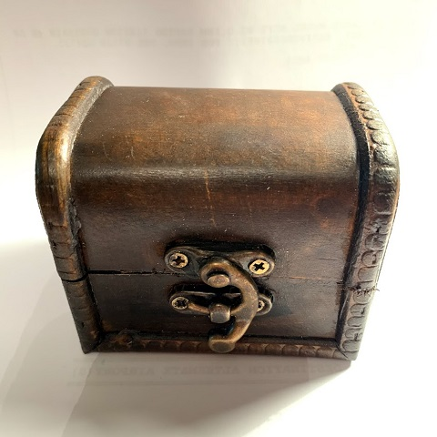

# RPGD

RPGD is a digital RPG Die housed in a wooden chest and controlled by a **magic** gem that can be rotated and clicked. This project builds on my previous [TRNG](https://github.com/nicolacimmino/TRNG) project to add that dash of **over-engineering** that makes every hobby project worth its time while guaranteeing absolutely unbiased and unpredictable output.

This is still WIP. I have got the enclosure for a £1.50 at a thrift store, the panels are thick grey board made less dull with some washi tape. The bottom panel is very likely to be final as it's very sturdy and snugly fits into the box while leaving enough play for the gem to click on the rotary encoder. The top panel though is rather flimsy.

