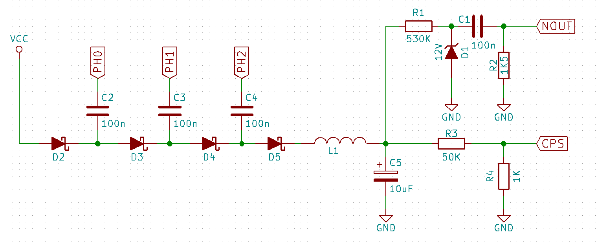
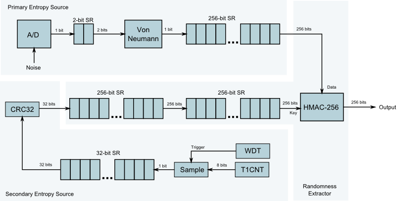

# RPGD

RPGD is a digital RPG Die housed in a wooden chest and controlled by a **magic** gem that can be rotated and clicked. This project builds on my previous [TRNG](https://github.com/nicolacimmino/TRNG) project to add that dash of **over-engineering** that makes every hobby project worth its time while guaranteeing absolutely unbiased and unpredictable output.

If you can't be arsed to go and check out my [TRNG](https://github.com/nicolacimmino/TRNG) project the bottom line is that, to generate the die throw outcome, I make use of a TRNG that uses noise from a Zener diode, driven by a charge pump as the voltage on board is too low for the Zener to enter breakdown. Below is the schematic of the analog part which I lifted from my other project, the rest is all done in software.

**NOUT** is the noise output which is then A/D converted and gets processed to extract a random sequence. **CPS**, which stands for Charge Pump Sense, is used to keep an eye on the voltage of the reserviour capacitor and restart running the pump when this gets too low. This allows to sample the noise while the charge pump is not running. If we would leave the pump running the ripple of the output voltage would swamp the noise.

Purely to brag, to make this project look more cool, and to re-assert the over-engineering aspect that was key in the planning phase below is a block diagram of how the sampled noise, plus another source of entropy which shall remain undisclosed (unless you go and check my [TRNG](https://github.com/nicolacimmino/TRNG) project), are combined and processed to give an output stream that might (or might be not) cryptographically secure but surely passed a lot of randomness tests.

This is still WIP. I have got the enclosure for a £1.50 at a thrift store, the panels are thick grey board made less dull with some washi tape. The bottom panel is very likely to be final as it's very sturdy and snugly fits into the box while leaving enough play for the gem to click on the rotary encoder. The top panel though is rather flimsy.

